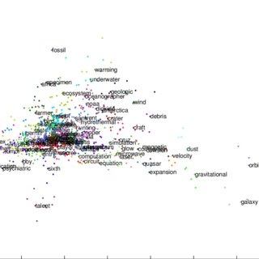

## Data Science In Apache Spark
## Natural Language Processing Use Case
### Using TF / IDF -> K-Means Clustering & LSH (MinHash)
### On Data From Small Business Innovation Research (SBIR)

**Language**: Scala and Python

**Requirements**: 
- Spark 2.4.X (Or Greater)

**Author**: Ian Brooks

**Follow** [LinkedIn - Ian Brooks PhD] (https://www.linkedin.com/in/ianrbrooksphd/)

## Project Goals
The goal is to use Spark's IDF/TF model to build features for downstream models.  In this use case, we are looking at Kmeans Clustering and LSH - MinHash.  The data will be sourced from SBIR's funding awards from 2019, and the hashing features will only be trained on the words in the abstract section of each of awards.  

Once feature engineering has been complete, the tokenized words will be based to a hashing function designed for TF/IDF and these features will be used to train a K-Means Clustering model and Locality Sensitive Hashing - MinHash model. The results of each models are listed below. 

## Source of Data Datasets 

[SBIR Search Site](https://www.sbir.gov/sbirsearch/award/all)

**Addtional Information**: The Small Business Innovation Research (SBIR) program is a highly competitive program that encourages domestic small businesses to engage in Federal Research/Research and Development (R/R&D) that has the potential for commercialization. Through a competitive awards-based program, SBIR enables small businesses to explore their technological potential and provides the incentive to profit from its commercialization. By including qualified small businesses in the nation's R&D arena, high-tech innovation is stimulated and the United States gains entrepreneurial spirit as it meets its specific research and development needs.

## Additional Information Links
* [Term Frequency–Inverse Document Frequency](https://en.wikipedia.org/wiki/Tf%E2%80%93idf)
* [PySpark: CountVectorizer|HashingTF](https://towardsdatascience.com/countvectorizer-hashingtf-e66f169e2d4e)
* [A Friendly Introduction to Text Clustering](https://towardsdatascience.com/a-friendly-introduction-to-text-clustering-fa996bcefd04)
* [K-Means Clustering](https://en.wikipedia.org/wiki/K-means_clustering)
* [Text clustering with K-means and tf-idf](https://medium.com/@MSalnikov/text-clustering-with-k-means-and-tf-idf-f099bcf95183)
* [Spark API- Feature Extractors](https://spark.apache.org/docs/2.2.3/ml-features.html#countvectorizer)
* [Locality-Sensitive Hashing - LSH](https://en.wikipedia.org/wiki/Locality-sensitive_hashing)
* [Scalable Jaccard similarity using MinHash and Spark](https://towardsdatascience.com/scalable-jaccard-similarity-using-minhash-and-spark-85d00a007c5e)
* [Spark - MinHash for Jaccard Distance](https://george-jen.gitbook.io/data-science-and-apache-spark/minhash-for-jaccard-distance)
* [Detecting Abuse at Scale: Locality Sensitive Hashing at Uber Engineering](https://databricks.com/blog/2017/05/09/detecting-abuse-scale-locality-sensitive-hashing-uber-engineering.html)
* [Read multiline JSON in Apache Spark](https://stackoverflow.com/questions/38545850/read-multiline-json-in-apache-spark)
* [Effectively Pre-processing the Text Data Part 1: Text Cleaning](https://towardsdatascience.com/effectively-pre-processing-the-text-data-part-1-text-cleaning-9ecae119cb3e)


## TF-IDF


In information retrieval, tf–idf, TFIDF, or TFIDF, short for term frequency–inverse document frequency, is a numerical statistic that is intended to reflect how important a word is to a document in a collection or corpus.

It is often used as a weighting factor in searches of information retrieval, text mining, and user modeling. The tf–idf value increases proportionally to the number of times a word appears in the document and is offset by the number of documents in the corpus that contain the word, which helps to adjust for the fact that some words appear more frequently in general. tf–idf is one of the most popular term-weighting schemes today.


## Import Data - Use the provided Jypter Notebook or run downloadData.sh

```bash
./downloadData.sh
```


## Tokeniziation - Tokenize the text and use as features for models  


## Option 1 - KMeans Clustering - Unsupervised ML
Document Clustering is a common task to find similar documents based on key words or other features.  This demo uses K-Means cluster on the features created by the Spark's IF-IDF model.  This unsupervised ML approach is well suited for the data since no label data is required.  Once trained, the K-Means will return a cluster assignment for each document based on the words in the abstract.




### KMeans - Results

Show the first 20 document cluster assignment. 


The following image displays the documents that were assigned to one particular cluster. 


## Option 2 - Locality Sensitive Hashing - MinHash

Locality-Sensitive Hashing (LSH) is an algorithmic technique that hashes similar input items into the same "buckets" with high probability.  Since similar items end up in the same buckets, this technique can be used for data clustering and nearest neighbor search. It differs from conventional hashing techniques in that hash collisions are maximized, not minimized.

### Common LSH Applications

* Near-duplicate detection
* Audio similarity identification
* Nearest neighbor search
* Audio fingerprint
* Digital video fingerprinting


### LSH - Set Search Terms

After the LSH model has been built, we can enter search terms and find matching values.  In this example, I have used the search terms: high, heat, and metal. 


### LSH - Results

In the results image, you can see the documents that are the most common based on the search terms that were entered. 


